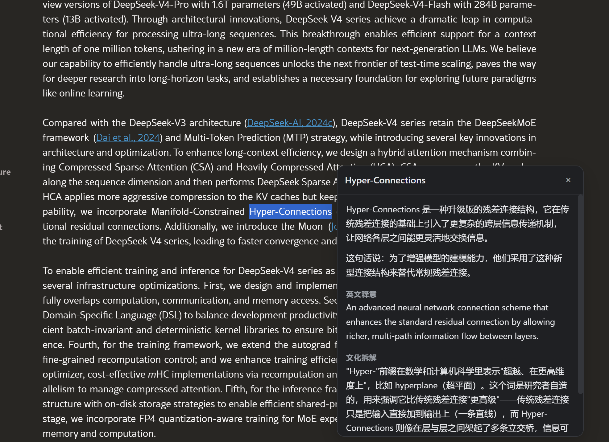
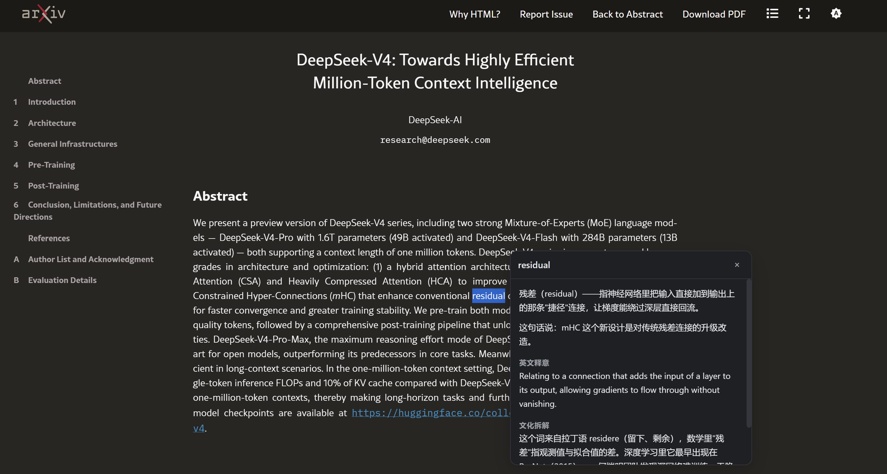
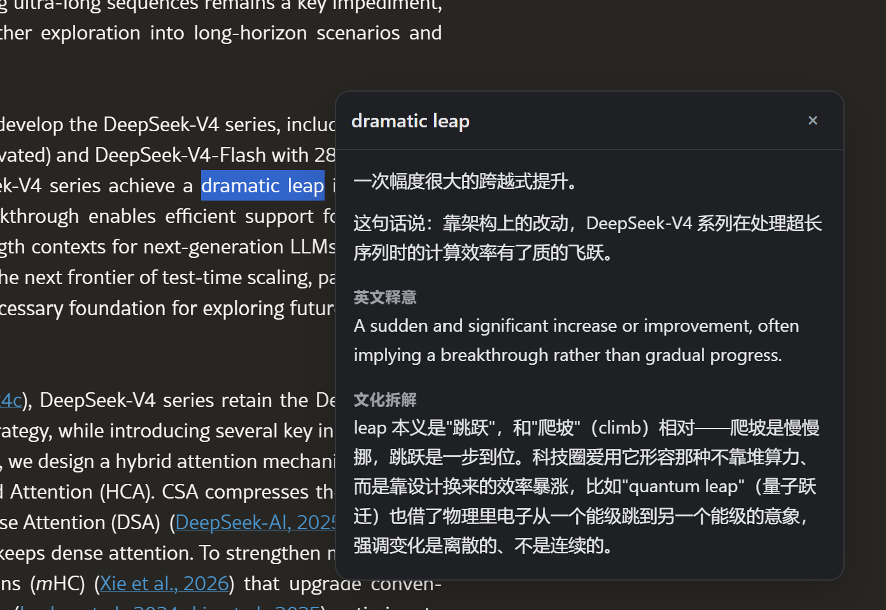
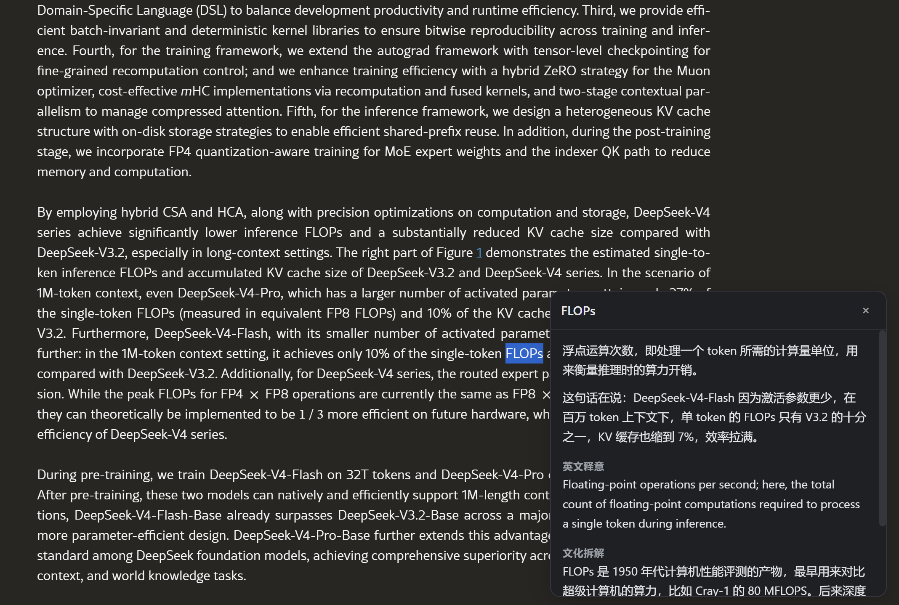

<div align="center">


# Context Lexicon · 语境词典

**读英文论文时，选中一个词，右边直接告诉你它在这句话里是什么意思、背后有什么文化和技术来历。**

一个只做一件事的 Chrome 扩展。用你自己的 DeepSeek API Key，数据不经过任何第三方。

[快速开始](#快速开始) · [它解决什么问题](#它解决什么问题) · [效果](#效果) · [English](#english)

</div>

---

## 它解决什么问题

读英文技术文章时，卡住你的通常不是"完全没见过的词"，而是这三种：

| 情况 | 例子 | 词典给你什么 | 这个插件给你什么 |
|---|---|---|---|
| **生词**，读到就断了 | `inklings` | 暗示；略知 | 在这句里是"刚冒头的一点苗头"，以及它源自"低声耳语"的来历 |
| **专业名词**，字面认识但不知道指什么 | `indexer`、`GRPO` | 查不到，或给个无关义项 | 在 MoE 里它是把 token 分派给专家的那个"分拣员" |
| **知道意思，但记不牢** | `residual`、`frontier` | 残差；边疆 | 为什么叫残差、frontier 在美国语境里是"西部拓荒线"——有了来历才记得住 |

第三种最容易被忽略。你查过八次 `residual`，还是记不住，因为词典只给了对应词，没告诉你**为什么英语世界要用这个词**。

Context Lexicon 每次回答三件事：

```
1. 它在这句话里是什么意思    ← 结合上下文，不是词典义
2. 英文释意                  ← 只写此处这一个义项
3. 文化拆解                  ← 词源、典故，或这个圈子当初为什么造它
```

---

## 效果

以下截图取自 [DeepSeek-V4 技术报告](https://arxiv.org/html/2606.19348v1)。

**专业名词** — 选中 `Hyper-Connections`，它说清这是残差连接的升级版，并拆开 "Hyper-" 前缀在数学里表示"更高维"的由来：



**似懂非懂的词** — 你知道 `residual` 是"残差"，但它为什么叫残差？



**地道表达** — `dramatic leap` 里的 leap 与 climb 相对，"爬坡是慢慢挪，跳跃是一步到位"：



**缩写与行话** — `FLOPs`、`GRPO`、`indexer` 这类词，词典查不到，但它知道：



---

## 快速开始

### 1. 拿到扩展

**方式 A：下载现成的**（推荐，不需要装任何开发工具）

到 [Releases](../../releases) 下载最新的 `context-lexicon.zip`，解压到一个不会误删的目录。

**方式 B：从源码构建**

```bash
git clone https://github.com/zzkws/context-lexicon.git
cd context-lexicon
npm install
npm run build
```

产物在 `dist/`。Windows PowerShell 5.1 不支持 `&&`，命令要分行写。

### 2. 装进 Chrome

1. 地址栏打开 `chrome://extensions`
2. 右上角打开**开发者模式**
3. 点**加载已解压的扩展程序**
4. 选中上一步的目录（`dist/` 或解压出来的文件夹）

### 3. 填 API Key

安装后会自动打开设置页。到 [platform.deepseek.com](https://platform.deepseek.com/api_keys) 创建一个 Key 粘贴进去，点**测试连接**确认通了，再点**保存**。

Key 只存在你本机的 `chrome.storage.local`，不上传到任何地方。

### 4. 用

打开任意英文文章，**鼠标左键划选一个词或短语，松手**。就这样。

| 操作 | 效果 |
|---|---|
| 划选英文词 / 短语 | 弹出解释 |
| `Esc` / 点浮层外 / 点右上角 | 关闭 |
| 划选新词 | 自动取消上一个请求 |
| 页面滚动 | 浮层跟着走 |

---

## 花多少钱

每次查词大约 **800～1300 输入 token + 100～250 输出 token**。按 DeepSeek 现价，读完一篇长论文查几十个词，成本在几分钱量级。

省钱的关键设计：**只发选中处的上下文窗口，不发整篇文章**。一篇 26,000 字符的论文，实际发出去的只有选中处往前 750、往后 1000 字符——够模型判断语义背景，又不白花 token。

---

## 设置项

| 设置 | 说明 |
|---|---|
| **API Key** | 你自己的 DeepSeek Key |
| **模型** | 默认 `deepseek-v4-flash`（快）；也可选 `deepseek-v4-pro` |
| **触发方式** | 选中即弹出 / 按住 `Alt` 选中才弹出 |
| **深度思考** | 默认关。开了慢一倍，查词场景不划算 |
| **浮层位置** | 贴着选中的词 / 固定在视口右侧 |
| **调试：打印上下文** | 开了会把每次真实发出的两条消息打进 service worker 控制台 |

---

## 它是怎么工作的

```
content script（页面内，隔离环境）
  ├─ article.ts    Readability 抽正文，按 URL 缓存
  ├─ selection.ts  选区 → 词 / 句 / 段（Intl.Segmenter + 缩写合并）
  └─ index.tsx     Shadow DOM 挂载 Preact 浮层
        │
        │  chrome.runtime.connect — 长连接，支持流式
        ▼
service worker（后台）
  ├─ prompt.ts     组装两条消息 + 截取上下文窗口
  └─ deepseek.ts   SSE 流式客户端
        │
        ▼  https://api.deepseek.com/chat/completions
```

几个不那么显然的设计：

**API 调用必须在 service worker 里。** content script 受宿主页面 CSP 约束，GitHub、Notion、多数新闻站会直接 block 掉 fetch。而且 API Key 不该出现在页面上下文里。

**上下文窗口往外扩到段落边界。** 避免从半句话开始，模型判断语义时不会被截断的句子带偏。

**上下文排在选中词前面。** DeepSeek 的缓存是前缀匹配的，同一段里连查几个词，窗口一致就能命中。

**浮层位置在开窗时一次算定。** 流式输出时卡片不再重新定位——否则文字每流进来一块就往上顶一下，一顿一顿的。

**数学公式走 KaTeX 的 MathML 输出**，Chrome 原生渲染，不必打包字体，而且只在正文真出现公式时才按需加载。

---

## 调教输出风格

风格全在 [`src/background/prompt.ts`](src/background/prompt.ts) 的 `SYSTEM` 常量里，改完 `npm run build` 重新加载即可。

[`docs/gold-examples.md`](docs/gold-examples.md) 收了 10 条金标样例，取自 DeepSeek-V4 技术报告，按"来历是哪一种"分成词源 / 生活典故 / 圈内惯例三组。其中 3 条作为 few-shot 写进了 prompt，一组一条。想换风格，照着这个文件改。

---

## 已知边界

- iframe 里的文字不支持（`all_frames: false`）
- Readability 在 Twitter、Reddit 这类非文章页抽不出正文，会自动兜底到 `document.body.innerText`
- **API Key 打包在扩展内，仅适合自用。** 若要上架商店必须换成后端代理——只需改 `src/background/deepseek.ts` 一个文件

---

## 开发

```bash
npm run dev      # Vite + CRXJS，content script 支持热更新
npm run build    # 类型检查 + 构建到 dist/
npm run zip      # 构建并打包成 context-lexicon.zip
npm run icons    # 重新生成图标
```

改了 `manifest.config.ts` 需要在 `chrome://extensions` 手动刷新一次。

技术栈：Manifest V3 · Vite + CRXJS · TypeScript · Preact · Shadow DOM · Readability · KaTeX

---

## License

MIT

---

<a name="english"></a>

# English

**A Chrome extension for Chinese speakers reading English technical papers.** Select a word and a panel explains what it means *in that sentence*, plus the etymology or field-specific origin behind it. Output is in Chinese.

## Why

What stops you when reading English papers is usually not a word you have never seen. It is one of these three:

- **An unfamiliar word** that breaks your reading (`inklings`)
- **A term of art** whose literal meaning you know but whose referent you do not (`indexer`, `GRPO`)
- **A word you have looked up eight times and still cannot retain** (`residual`, `frontier`) — because a dictionary gives you a translation, never *why English chose that word*

Context Lexicon always answers three things: what it means here, an English gloss of this specific sense, and where the word comes from.

## Quick start

1. Download `context-lexicon.zip` from [Releases](../../releases) and unzip — or build from source with `npm install` then `npm run build`
2. Open `chrome://extensions`, enable **Developer mode**, click **Load unpacked**, select the folder
3. The options page opens automatically. Paste your own [DeepSeek API key](https://platform.deepseek.com/api_keys), click 测试连接 to verify, then 保存
4. Select any English word on any page

Your key is stored in `chrome.storage.local` on your machine only. Nothing passes through a third-party server.

## Notes

- Only the context window around your selection is sent (750 chars before, 1000 after), not the whole article
- Prompt and output style live in [`src/background/prompt.ts`](src/background/prompt.ts); ten reference examples are in [`docs/gold-examples.md`](docs/gold-examples.md)
- The API key is bundled client-side, which is fine for personal use. Publishing to the Chrome Web Store would require a backend proxy — one file, `src/background/deepseek.ts`

MIT License.
